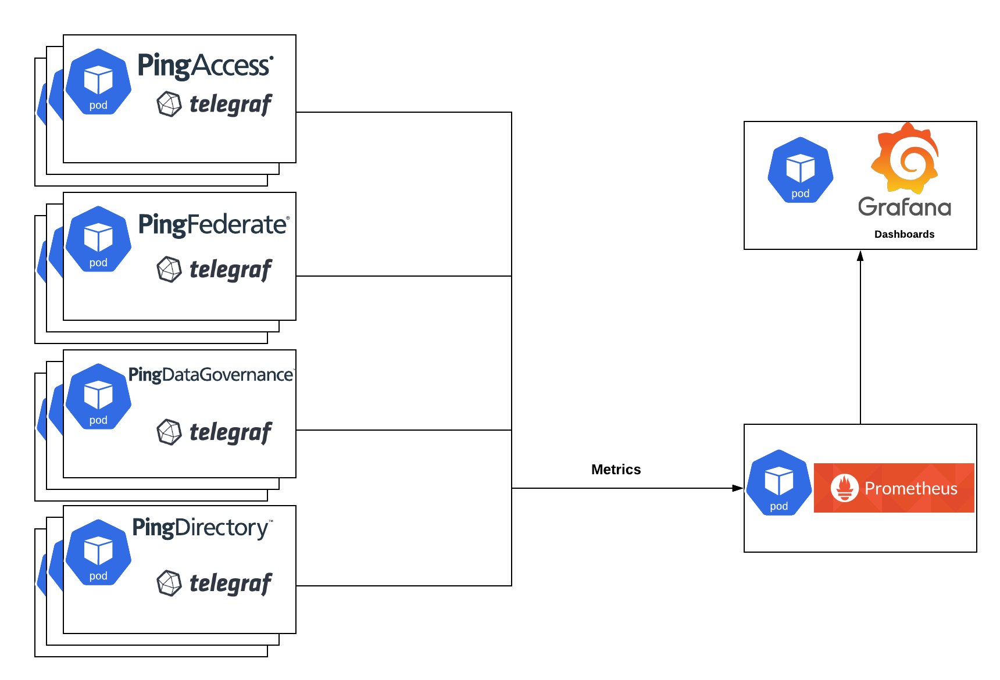
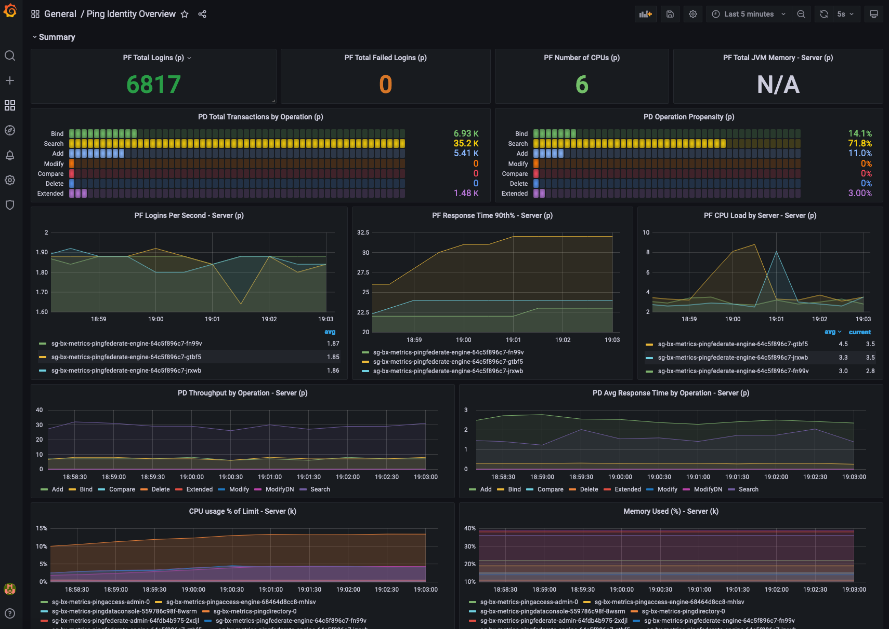

# Deploy a Kubernetes Cluster Metrics Stack



This document covers deploying and using a sample open-source monitoring stack in a Kubernetes cluster. The resulting stack is not a "Production-ready" install, rather it is meant to show how quickly Ping DevOps software can produce metrics for consumption by a popular open-source monitoring system. This metrics stack is not maintained or directly supported by Ping.

## Stack Components

**Open Source Tools**

- [kube-prometheus-stack](https://github.com/prometheus-community/helm-charts/tree/main/charts/kube-prometheus-stack) - _includes_:
  - [Prometheus](https://prometheus.io/) - Metrics collection and storage.
  - [Grafana](https://grafana.com/) - Metrics visualization in Dashboards.
- [telegraf-operator](https://github.com/influxdata/helm-charts/tree/master/charts/telegraf-operator) - Metrics exposure and formatting.

**Grafana Dashboard** - JSON file to import for dashboard definition.

**ping-devops values.yaml** - values relevant only to exposing metrics for Ping Identity software.

## Prerequisites

Beyond prerequisites covered in base Helm examples:

- Knowledge of Prometheus, Grafana, and Telegraf is helpful

## Deploy the Stack

Edit the Prometheus `01-prometheus-values.yaml` as needed. This file contains configurations provided beyond the defaults of kube-prometheus-stack. In this sample deployment, the monitoring stack is given very powerful read access to the entire cluster and is deployed into the `metrics` namespace. Changing these settings or making a "production-ready" install is beyond scope of this doc. The full set of optional values can be found on the chart github.

There are numerous lines that have `##CHANGEME`. The following lines should be heavily considered for configuration.

Once ready, deploy the `kube-prometheus-stack`

```
kubectl create namespace metrics
helm install metrics --repo https://prometheus-community.github.io/helm-charts kube-prometheus-stack -n metrics --version 30.0.1 -f 16-cluster-metrics/01-prometheus-values.yaml
```

Deploy `telegraf-operator`:

```
helm install telegraf --repo https://github.com/influxdata/helm-charts telegraf-operator -n metrics --version 1.3.3 -f 02-telegraf-values.yaml
```

Telegraf operator makes it very easy to add monitoring sidecars to your deployments. All you need to do is add annotaions, which are shown in `16-cluster-metrics/03-ping-with-metrics-values.yaml`

These values can be copied to your ping-devops values.yaml manually, or the file can be referenced at the end of your helm install command. For example:

```
helm upgrade --install ping-metrics pingidentity/ping-devops -f my-values.yaml -f 16-cluster-metrics/03-ping-with-metrics-values.yaml
```

Once the Ping software is healthy and producing metrics, there should be sidecars on Ping pods.

```
NAME                                                 READY   STATUS
ping-metrics-pingaccess-admin-0                     1/1     Running
ping-metrics-pingaccess-engine-68464d8cc8-mhlsv     2/2     Running
ping-metrics-pingdataconsole-559786c98f-8wsrm       1/1     Running
ping-metrics-pingdirectory-0                        2/2     Running
ping-metrics-pingfederate-admin-64fdb4b975-2xdjl    1/1     Running
ping-metrics-pingfederate-engine-64c5f896c7-fn99v   2/2     Running
```

Note `2/2` on pods with sidecars.

## View Metrics

Browse to Grafana via the Ingress URL or port-forward.
Log in with the `admin` user and password set in `01-prometheus-values.yaml`

Next, upload `04-ping-overview-dashboard.json` via the `+` on the left of Grafana's home screen.

The `Ping Identity Overview` dashboard will have a dropdown for namespace at the top. Select your namespace to see:



Any of the panels can be edited, or new ones made to fit needs.
